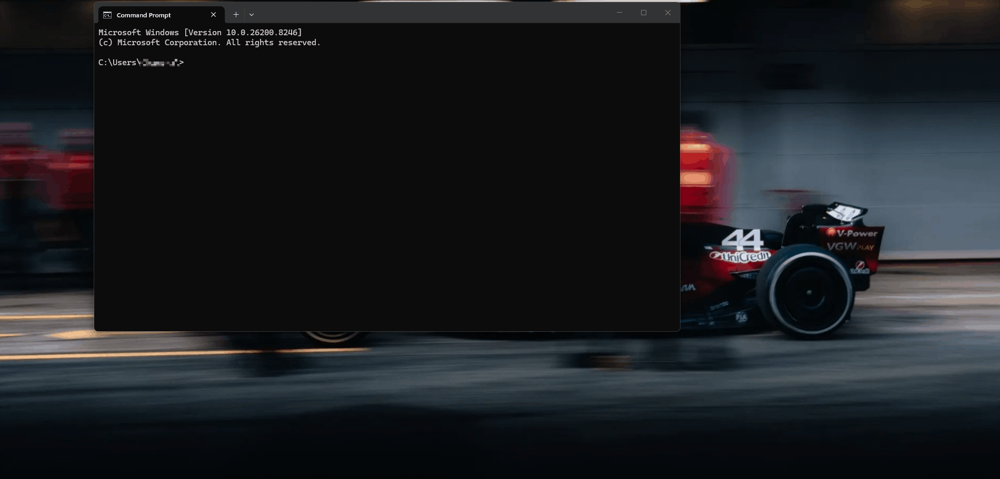

# CANviz

**A browser-based CAN bus analyzer. Plug in. One command. Analyze.**

[](https://github.com/Chanchaldhiman/CANviz/actions)
[](https://pypi.org/project/canviz/)
[](https://pepy.tech/project/canviz)
[](https://pepy.tech/project/canviz)
[](https://pypi.org/project/canviz/)
[](LICENSE)


```bash
pip install canviz
canviz
# browser opens at http://localhost:8080
```



CAN bus tools are either expensive, locked to proprietary hardware, or require compiling
from source. CANviz is different: it runs in your browser, installs with one pip command,
and works with any USB CAN adapter including adapters that cost under $10.

No GUI install. No driver setup. No account. No internet connection. Whether you are
debugging an ECU, commissioning a servo drive, analyzing J1939 truck traffic, or working
on a robot arm over CANopen, CANviz puts every frame, signal, and protocol event in
front of you immediately.

---

## Install and Run

```bash
pip install canviz
canviz
```

That is it. CANviz detects your connected adapter and opens the browser automatically.

> **Not sure which interface to select?** See the [Device Guide](docs/interfaceguide.md).

---

## What You Get

See [CHANGELOG.md](docs/CHANGELOG.md) for full version history.

### Live message table

Every frame on the bus, in real time. ID, DLC, raw bytes, frame count, rate, and
last-seen timestamp. Virtual scrolling handles thousands of rows without frame loss.
Tested at 2,000 fps sustained with zero drops.

### DBC signal decoding

Upload a `.dbc` file and raw hex bytes become named signal values, shown inline in the
message table. Toggle between raw and decoded view at any time.

### Signal time-series plotting

Plot any decoded signal as a live time-series graph. Up to 8 signals on a shared time
axis, 36,000 buffered points per signal, LTTB downsampling, 10 Hz render rate regardless
of bus speed. Drag to zoom, double-click to resume live scroll, set per-signal threshold
lines with breach alerts. One-click PNG export.

### Multi-frame transmit with timers

Build a list of frames, each with its own independent transmission interval. Send a
heartbeat at 20 Hz and a speed signal at 10 Hz simultaneously. State persists across
tab switches.

### Record and replay

Record to industry-standard `.asc` and `.csv`. Replay any log file with adjustable
speed from 0.5x to 10x.

### Bus health statistics

Always-visible status bar: frames Rx/Tx, bus load %, error frame count, bus-off events,
throughput. Error frame visibility depends on hardware -- slcan firmware typically drops
error frames silently; a tooltip explains this when a slcan interface is active.

### CLI and headless mode

`canviz monitor` renders a live colour-coded table in the terminal over SSH, in CI
pipelines, and on headless Raspberry Pi setups. See [CLI Reference](#cli-reference).

---

## Protocol Decoders

CANviz includes passive decoders for J1939 and CANopen. They run entirely from captured
traffic -- no extra hardware, no polling, no configuration required beyond enabling the
decoder in the UI. Both decoders appear in the right-side protocol panel which sits
alongside the message table and is resizable.

### J1939

J1939 is the dominant protocol in trucks, agriculture, marine, and construction equipment.

- **Auto-detection** at 250 kbps with 29-bit extended IDs
- **CAN ID decomposition** -- Priority, PGN, Source Address, Destination Address on every frame
- **54 built-in PGN names** -- EEC1, CCVS, DM1, ET1, AMB, VEP1, transport protocol and more
- **99 source address names** -- "Engine #1", "Brakes - System Controller", "Diesel Particulate Filter Controller"
- **BAM transport reassembly** -- multi-packet messages (VIN, software ID, long DM payloads) shown complete
- **DM1 active fault decode** -- SPN number, component name, Failure Mode Indicator, occurrence count, lamp status

See [J1939 Guide](docs/j1939.md) for full documentation and DBC-based signal decode.

### CANopen (CiA 301 + CiA 402)

CANopen is the dominant protocol in robotics, industrial automation, and motion control.
CiA 402 covers virtually every servo drive and motor controller.

- **Auto-detection** from COB-ID structure -- no bitrate assumption needed
- **Nodes table** -- NMT state, heartbeat interval, frame count per node
- **CiA 402 drive state** -- Statusword decoded to named state (Operation Enabled, Fault, Quick Stop etc.) shown inline per node
- **CiA 402 Drive Control** -- Quick buttons: Enable, Switch On, Shutdown, Quick Stop, Disable, Fault Reset. One-time safety notice.
- **EMCY decode** -- error code, error class name, error register flags, manufacturer data
- **SDO log** -- request/response pairs auto-paired from bus traffic with object names from a 180-entry built-in CiA 301/402 dictionary
- **SDO Read / Write** -- send expedited reads and writes to any live node from the panel
- **NMT commands** -- Operational, Pre-Op, Stop, Reset Node, Reset Comm with node selector
- **Object dictionary browser** -- search 180 standard objects by name or index
- **PDO signal plotting** -- upload a device EDS file to decode TPDO payloads to named signals that feed the Plot tab
- **Read All Node Objects** -- one click reads 15 standard CiA 301/402 objects from every discovered node

See [CANopen Guide](docs/canopen.md) for full documentation, EDS requirements, drive
control safety notes, and REST API reference.

---

## Hardware

Any adapter running **Candlelight firmware** works plug-and-play on Windows with no
driver setup:

| Hardware | Price | Notes |
|----------|-------|-------|
| FYSETC UCAN (STM32F072) | ~$8 | Validated reference hardware |
| CANable 1.0 (Candlelight) | ~$15 | Widely available |
| DSD TECH SH-C31A | ~$20 | gs_usb / slcan both tested |
| GY / Seeed Studio USB-CAN | ~$15 | Select `USB-CAN Analyzer (GY/Seeed)` |
| Any gs_usb / WinUSB device | varies | Should work |

**Also supported via python-can configuration:**

- **slcan** -- devices running slcan firmware (COM port on Windows)
- **SocketCAN** -- Linux, Raspberry Pi, WSL2
- **PEAK PCAN-USB** -- requires PEAK driver installed
- **Kvaser** -- supported in config, see [Known Limitations](#known-limitations)
- **Virtual bus** -- software loopback, no hardware needed

---

## Security Model

```
Browser  (your local browser tab)
    |  HTTP + WebSocket -- localhost only, never leaves your machine
Python backend  (127.0.0.1:8080)
    |  python-can
USB CAN adapter
    |
CAN Bus
```

The browser communicates only with a local Python process at `127.0.0.1:8080`. No data
leaves your machine. No cloud. No telemetry. No external connections of any kind. All
USB communication happens inside the Python backend -- the browser never has direct
access to your USB device or CAN bus.

The security model is the same as running any locally installed Python tool: you are
trusting the code you installed via pip. If you are security-conscious, review the
source on GitHub before installing.

**Remote deployments:** Use the default `--host 127.0.0.1` binding and access via SSH
port forwarding. Do not expose port 8080 to an untrusted network without a reverse
proxy with authentication.

---

## CLI Reference

```
canviz [OPTIONS]

  --interface   gs_usb | slcan | socketcan | virtual  (default: gs_usb)
  --channel     COM port or SocketCAN channel  (e.g. COM3, can0)
  --bitrate     CAN bitrate in bps  (default: 500000)
  --host        Host to bind to  (default: 127.0.0.1)
  --port        Port to bind to  (default: 8080)
  --headless    Start without opening a browser
```

**Subcommands:**

```bash
# Live terminal monitor -- works over SSH
canviz monitor --interface socketcan --channel can0 --dbc vehicle.dbc

# Capture frames to file
canviz capture --output trace.json --duration 60

# Decode a captured log
canviz decode --input trace.json --dbc vehicle.dbc --output decoded.csv

# API-only server, no browser
canviz serve --headless --port 8080
```

See the [CLI Guide](docs/cli.md) for full SSH workflow documentation.

---

## REST API and WebSocket

Full interactive docs at `http://localhost:8080/docs` while running.

| Method | Path | Description |
|--------|------|-------------|
| POST | `/connect` | Open CAN interface |
| POST | `/disconnect` | Close interface |
| GET | `/status` | Connection state and config |
| GET | `/stats` | Bus statistics snapshot |
| POST | `/send` | Transmit a CAN frame |
| WS | `/ws/frames` | Live frame and stats stream (JSON) |
| POST | `/dbc/load` | Upload a DBC file |
| GET | `/dbc/messages` | List decoded message definitions |
| DELETE | `/dbc` | Unload DBC |
| POST | `/log/start` | Start recording |
| POST | `/log/stop` | Stop and finalise log |
| GET | `/log/download/{file}` | Download `.asc` or `.csv` |
| POST | `/replay/start` | Start replaying a log file |
| POST | `/replay/stop` | Stop replay |
| GET | `/canopen/status` | CANopen decoder state, nodes, SDO log |
| POST | `/canopen/sdo/read` | Send SDO upload request to a node |
| POST | `/canopen/sdo/write` | Send SDO download to a node |
| POST | `/canopen/nmt` | Send NMT command |
| GET | `/canopen/objects` | Search built-in CiA 301/402 object dictionary |

---

## Architecture

```
[CAN Bus]
    |
[USB CAN Module]  ~$8-$65 depending on capability
    |
[Python Backend]
  FastAPI  python-can  cantools  aiofiles  typer  rich
    |  HTTP + WebSocket (localhost only)
[Browser UI]
  React 18  TanStack Table  TanStack Virtual  Zustand  uPlot
    |
  http://localhost:8080
```

---

## Known Limitations

- **USB timestamp jitter ~1 ms** -- a hardware limitation of USB-connected CAN adapters. Not suitable for sub-millisecond timing analysis.
- **High bus load above 2,000 fps** -- untested. A server-side throttling hook is built in and can be enabled if needed.
- **CAN FD** -- frames with >8 byte payloads display as raw hex. Full CAN FD UI is planned.
- **slcan error frames** -- slcan firmware silently drops error frames before forwarding. Bus error statistics read 0% on slcan interfaces even on a degraded bus. Use gs_usb for accurate error visibility.
- **Kvaser on Windows** -- CANviz has full UI support. Connection fails due to a bug in python-can 4.6.1 (`canIoCtlInit` returning `canERR_PARAM`). Tracked at [python-can #2051](https://github.com/hardbyte/python-can/issues/2051). Upgrade python-can once resolved and Kvaser will work without any CANviz changes.
- **CANopen PDO decode** -- requires the device EDS file. Without EDS, TPDO1 bytes 0-1 are decoded as Statusword by default assumption; other PDO bytes are raw hex.
- **CANopen SDO segmented / block transfer** -- only expedited SDO (1-4 byte payloads) is decoded. Segmented responses show as raw data.
- **J1939 PGN database** -- SAE J1939 Digital Annex is copyrighted and cannot be redistributed. The built-in 54-PGN table covers common engine and vehicle signals. Load your own DBC for full coverage.
- **Replay timing** -- depends on the Python asyncio scheduler, not a hardware clock.
- **Browser support** -- tested on Chrome. Firefox and Edge are best-effort.
- **Mobile layout** -- not a target. Optimised for 1080p and above.

---

## Troubleshooting

**`No matching distribution found for canviz` on Ubuntu / Linux**
- Use `pip3 install canviz` or `python3 -m pip install canviz`. CANviz requires Python
  3.10+. Ubuntu 20.04 ships Python 3.8 -- upgrade to 22.04+ or install Python 3.10
  separately.
- If still doesn't work then try installing with pipx,
`sudo apt install pipx`
`pipx ensurepath`,
then try
`pipx install canviz`

**Device shows a COM port on Windows**
Your adapter is running slcan firmware, not Candlelight.
Use: `canviz --interface slcan --channel COM3`

**PEAK PCAN-USB fails to connect**
Ensure the [PEAK driver](https://www.peak-system.com/Drivers.523.0.html) is installed.
Device Manager must show the device under **CAN-Hardware**, not as an unknown device.

**Kvaser fails to connect (`canIoCtl failed -- Error in parameter`)**
Known bug in python-can 4.6.1. See [Known Limitations](#known-limitations).

**CANopen nodes not appearing**
Enable the decoder, then wait one heartbeat cycle (typically 250-1000 ms). If nodes
have heartbeat disabled (0x1017 = 0), send an NMT Operational broadcast first.

**CANopen SDO Read returns ABORT**
The node rejected the request. Common causes: object does not exist in that node's
object dictionary (0x06020000), or the object is write-only (0x06010001). Check the
abort code in the SDO log for the exact reason.

---

## Roadmap

- [x] Live frame table, DBC decode, filter, send, record, replay, pip install
- [x] Signal plotting, multi-signal overlay, threshold alerts, CLI mode, bus health statistics, multi-frame transmit
- [x] J1939 passive decoder -- PGN/SA decode, BAM reassembly, DM1 fault decode
- [x] CANopen CiA 301 + CiA 402 -- NMT, EMCY, SDO, PDO, heartbeat, drive control
- [ ] CAN FD explicit UI support (>8 byte payloads, FDF/BRS/ESI flags)
- [ ] OBD-II over raw CAN -- ISO 15765-4, no ELM327 required
- [ ] UDS diagnostic panel -- ReadDataByIdentifier, ReadDTCInformation, ClearDTC
- [ ] Reverse engineering toolkit -- bit-flip rate heatmap, notch-filter sniffer, auto DBC generation
- [ ] Plugin API -- pip-installable community decoders and exporters

---

## Contributing

CANviz is actively developed. The most useful contribution right now is testing hardware
we have not tried -- a CANable 2.0, anything on macOS, anything on a COM port. No code
required. Open an issue and tell us what happened.

Bug reports, DBC files that decode incorrectly, and code contributions are all welcome.
See [CONTRIBUTING.md](CONTRIBUTING.md) for how to get the dev environment running.

---

## Acknowledgements

CANviz is built on the shoulders of excellent open source work. None of this would exist
without:

- **[python-can](https://github.com/hardbyte/python-can)** -- the hardware abstraction layer that makes every CAN adapter work with the same three lines of Python. The most important dependency in the stack.
- **[cantools](https://github.com/eerimoq/cantools)** -- DBC parsing and signal decoding. Rock-solid, well-maintained, handles every DBC dialect we have thrown at it.
- **[canopen](https://github.com/christiansandberg/canopen)** -- CiA 301 object dictionary parsing and EDS support. Powers the CANopen PDO decode pipeline.
- **[FastAPI](https://github.com/tiangolo/fastapi)** -- the backend API framework. The async WebSocket support and automatic OpenAPI docs are genuinely excellent.
- **[uPlot](https://github.com/leeoniya/uPlot)** -- an absurdly fast time-series plotting library. 36,000 points per signal at 10 Hz with no jank takes real engineering skill to pull off, and Leon Sorokin pulled it off.
- **[TanStack Table](https://github.com/TanStack/table)** and **[TanStack Virtual](https://github.com/TanStack/virtual)** -- virtual scrolling thousands of CAN frames without dropping a row is not trivial. These libraries make it straightforward.
- **[Zustand](https://github.com/pmndrs/zustand)** -- minimal, fast, and does not get in the way. State management that earns its place.
- **[Typer](https://github.com/fastapi/typer)** and **[Rich](https://github.com/Textualize/rich)** -- the CLI terminal output looks good because of these two.
- **[pretty_j1939](https://github.com/nmfta-repo/pretty_j1939)** -- the open J1939 PGN and SPN definitions that power the J1939 decoder's built-in name table.

Thank you to everyone who filed issues, tested hardware, and sent DBC files. Every
piece of feedback made the tool better.

---

## Support

CANviz is free and open source. If it saves you time or helps your project, consider
[sponsoring development on GitHub](https://github.com/sponsors/Chanchaldhiman). Every
sponsorship directly funds hardware for testing new adapters and protocols.

---

## License

MIT -- see [LICENSE](LICENSE).