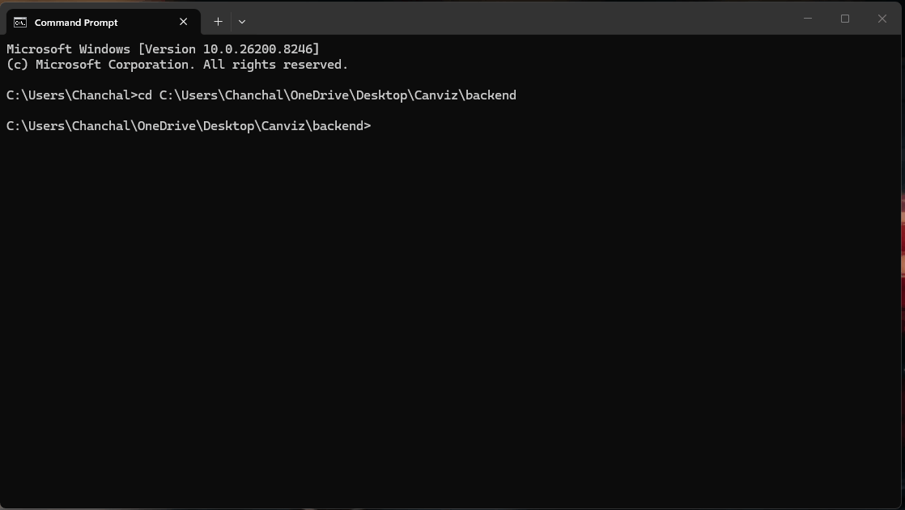

# CANviz CLI & Headless Guide

CANviz has two modes of operation:

- **Browser UI** - `canviz serve` starts a local web server and opens your browser. This is the default.
- **CLI mode** - `canviz monitor`, `canviz capture`, and `canviz decode` run entirely in the terminal - no browser, no server. Designed for SSH sessions, Raspberry Pi, automated test benches, and shell pipelines.

---



---

## Quick reference

| Command | What it does |
|---|---|
| `canviz` | Start the web server and open the browser (default) |
| `canviz serve --headless` | Start the API + WebSocket only - no browser opens |
| `canviz monitor` | Live frame table in the terminal |
| `canviz capture` | Record frames to a JSON file |
| `canviz decode` | Apply DBC signal decode to a captured file |

---

## Interface options (shared across all commands)

Every command accepts the same interface flags:

| Flag | Default | Description |
|---|---|---|
| `--interface` | `gs_usb` | `gs_usb` · `slcan` · `socketcan` · `virtual` |
| `--channel` | _(empty)_ | Required for `slcan` (e.g. `COM3`) and `socketcan` (e.g. `can0`) |
| `--bitrate` | `500000` | CAN bus bitrate in bps |
| `--index` | `0` | gs_usb device index when multiple adapters are plugged in |

---

## `canviz serve` - Web server

This is the default command. Running `canviz` with no subcommand is identical to `canviz serve`.

```
canviz serve [OPTIONS]
```

**Start the server and open the browser (default):**
```
canviz serve --interface gs_usb
```

**Headless - API + WebSocket only, browser does not open:**
```
canviz serve --interface socketcan --channel can0 --headless
```

Use `--headless` when running CANviz over SSH, in Docker, or as part of an automated pipeline where another process will consume the WebSocket stream. The full REST API and `/ws/frames` WebSocket are still available - only the `webbrowser.open()` call is skipped.

**Additional flags:**

| Flag | Default | Description |
|---|---|---|
| `--host` | `127.0.0.1` | Host to bind (use `0.0.0.0` to expose on the network) |
| `--port` | `8080` | Port to listen on |
| `--headless` | off | Skip opening a browser |
| `--log-level` | `info` | `debug` · `info` · `warning` · `error` |

> **Tip - SSH users:** Run `canviz serve --headless` on the remote machine, then use SSH port forwarding to access the UI from your local browser:
> ```
> ssh -L 8080:localhost:8080 user@your-pi-ip
> ```
> Then open `http://localhost:8080` in your local browser.

---

## `canviz monitor` - Live terminal table

Watch live CAN frames directly in your terminal. No browser required.

```
canviz monitor [OPTIONS]
```

**Basic usage:**
```
canviz monitor --interface virtual
```

**Expected output:**
```
  Monitoring virtual @ 500000 bps - Ctrl+C to stop

 ID (hex)   Name              DLC   Data                      Count    Rate (fps)   Last seen
 ────────── ───────────────── ───── ──────────────────────── ──────── ──────────── ──────────
 000001A4   EngineData          8   FF 12 00 3C 00 00 00 00   4,821      100.0      0.01s
 000002B0   TransmissionData    8   01 00 64 00 00 00 00 00   4,820       99.9      0.01s
 000003C0   -                   4   AA BB CC DD               1,205       25.0      0.04s
```

Data bytes are **colour-coded on change:**
- Green - value increased since last frame
- Red - value decreased
- White - unchanged (stable signal)

**With a DBC file for signal names:**
```
canviz monitor --interface gs_usb --dbc vehicle.dbc
```

Signal names from the DBC appear in the `Name` column. Message IDs not in the DBC show `-`.

**Available flags:**

| Flag | Default | Description |
|---|---|---|
| `--dbc` | _(none)_ | Path to a `.dbc` file for signal name lookup |
| `--refresh-rate` | `4.0` | Table refresh rate in Hz |

**Pipe mode (non-TTY):**

When stdout is not a terminal (piped to another command), `canviz monitor` automatically switches to plain JSON lines - one object per frame, no Rich formatting or escape codes:

```
canviz monitor --interface virtual | grep "000001A4"
```
```json
{"ts": 1.234567, "id": "000001A4", "dlc": 8, "data": "FF 12 00 3C 00 00 00 00", "name": "EngineData"}
{"ts": 1.244891, "id": "000001A4", "dlc": 8, "data": "FF 13 00 3C 00 00 00 00", "name": "EngineData"}
```

Pipe it to `jq` for structured filtering:
```
canviz monitor --interface socketcan --channel can0 | jq 'select(.id == "000001A4")'
```

**Stop:** `Ctrl+C` - prints a summary of unique IDs and total frames seen.

---

## `canviz capture` - Record frames to a file

Record all frames on the bus to a JSON file for offline analysis or replay.

```
canviz capture [OPTIONS]
```

**Capture for 60 seconds then stop automatically:**
```
canviz capture --interface gs_usb --duration 60 --output my_trace.json
```

**Capture until Ctrl+C (no duration limit):**
```
canviz capture --interface socketcan --channel can0 --output run1.json
```

**Expected output while capturing:**
```
  Capturing → my_trace.json  (max 60s) - Ctrl+C to stop
     12,483 frames  14.2s / 60s
```

**After capture completes:**
```
  Saved 51,200 frames → my_trace.json (3,840 KB)
```

**Available flags:**

| Flag | Default | Description |
|---|---|---|
| `--output` / `-o` | `canviz_YYYYMMDD_HHMMSS.json` | Output file path |
| `--duration` / `-d` | _(none - run until Ctrl+C)_ | Capture duration in seconds |

**Output file format:**

The JSON file contains a `meta` block and a `frames` array:

```json
{
  "meta": {
    "interface": "gs_usb",
    "channel": "",
    "bitrate": 500000,
    "captured_at": "2026-04-22T14:32:01.123456",
    "duration_s": 60.012,
    "frame_count": 51200
  },
  "frames": [
    {
      "ts": 0.000123,
      "id": 420,
      "id_hex": "000001A4",
      "dlc": 8,
      "data": [255, 18, 0, 60, 0, 0, 0, 0],
      "is_extended_id": false,
      "is_error_frame": false,
      "is_fd": false
    }
  ]
}
```

---

## `canviz decode` - Apply DBC signal decode to a captured file

Takes a `.json` capture file and a DBC, decodes every frame, and writes the result to a file or stdout.

```
canviz decode --input trace.json --dbc vehicle.dbc [OPTIONS]
```

### Save decoded output to a file

**JSON output (default):**
```
canviz decode --input my_trace.json --dbc vehicle.dbc --output decoded.json
```

**CSV output (one row per signal per frame - opens directly in Excel):**
```
canviz decode --input my_trace.json --dbc vehicle.dbc --format csv --output signals.csv
```

**Expected terminal output:**
```
  Saved 51,200 frames (48,930 decoded) → decoded.json (12 KB)
```

Frames with IDs not in the DBC are included in the output with empty signal fields - they are not silently dropped.

### CSV format

The CSV has one row per signal per frame:

```csv
ts,id_hex,message,signal,value
0.000123,000001A4,EngineData,EngineRPM,820.0
0.000123,000001A4,EngineData,CoolantTemp,87.5
0.010241,000001A4,EngineData,EngineRPM,824.0
0.010241,000001A4,EngineData,CoolantTemp,87.5
```

This format loads directly into Excel, pandas, or any data tool without further transformation.

**Load in pandas:**
```python
import pandas as pd
df = pd.read_csv("signals.csv")
rpm = df[df["signal"] == "EngineRPM"]
print(rpm["value"].describe())
```

### Pipe to shell tools (stdout mode)

Omit `--output` to write to stdout - useful for filtering or chaining:

```
# Show only signals from one message ID
canviz decode --input trace.json --dbc vehicle.dbc | jq '.[] | select(.id_hex == "000001A4")'

# Get just signal names and values
canviz decode --input trace.json --dbc vehicle.dbc | jq '.[] | .signals'

# CSV to grep
canviz decode --input trace.json --dbc vehicle.dbc --format csv | grep EngineRPM
```

**Available flags:**

| Flag | Default | Description |
|---|---|---|
| `--input` / `-i` | _(required)_ | `.json` file from `canviz capture` |
| `--dbc` | _(required)_ | DBC file for signal decoding |
| `--format` / `-f` | `json` | `json` or `csv` |
| `--output` / `-o` | _(stdout)_ | Output file. Omit to write to stdout. |

---

## Common workflows

### SSH into a Raspberry Pi and monitor live

On the Pi:
```
pip install canviz
sudo ip link set can0 up type can bitrate 500000
canviz monitor --interface socketcan --channel can0 --dbc vehicle.dbc
```

### Run the API headless on a Pi, view UI on your laptop

On the Pi:
```
canviz serve --interface socketcan --channel can0 --headless
```

On your laptop (in a separate terminal):
```
ssh -L 8080:localhost:8080 user@pi-ip-address
```

Then open `http://localhost:8080` in your browser.

### Capture, decode, and analyse offline

```bash
# Step 1 - capture 2 minutes of data
canviz capture --interface gs_usb --duration 120 --output drive_cycle.json

# Step 2 - decode to CSV
canviz decode --input drive_cycle.json --dbc vehicle.dbc --format csv --output drive_cycle.csv

# Step 3 - open drive_cycle.csv in Excel, or load with pandas
```

### Automated test bench - CI/CD

```bash
# Start headless server, wait for it, run test, shut down
canviz serve --interface virtual --headless &
SERVER_PID=$!
sleep 2

# Your test script hits the REST API or WebSocket
python run_tests.py

kill $SERVER_PID
```

---

## Shell autocomplete

CANviz uses Typer, which generates shell completion scripts automatically.

**bash:**
```
canviz --install-completion bash
source ~/.bashrc
```

**zsh:**
```
canviz --install-completion zsh
source ~/.zshrc
```

**fish:**
```
canviz --install-completion fish
```

After installing, press `Tab` after `canviz` to see subcommands, and `Tab` again after `--interface` to see valid options.

---

## Limitations

- `canviz monitor` shows per-ID rate and last-seen - it does not decode individual signal values in the table. Load the DBC in the browser UI for per-signal detail, or use `canviz capture` + `canviz decode` for offline analysis.
- `canviz capture` stores raw bytes only. Signal decoding happens in the `decode` step, not at capture time - this keeps the capture loop fast and the capture file format stable even if the DBC changes.
- `--headless` still opens port 8080. If deploying on a shared or remote machine, you are responsible for firewall rules.
- `canviz monitor` colour coding is based on byte sum delta - it is a heuristic to show "something changed", not a precise signal-level diff. Use the browser UI for signal-level detail.
