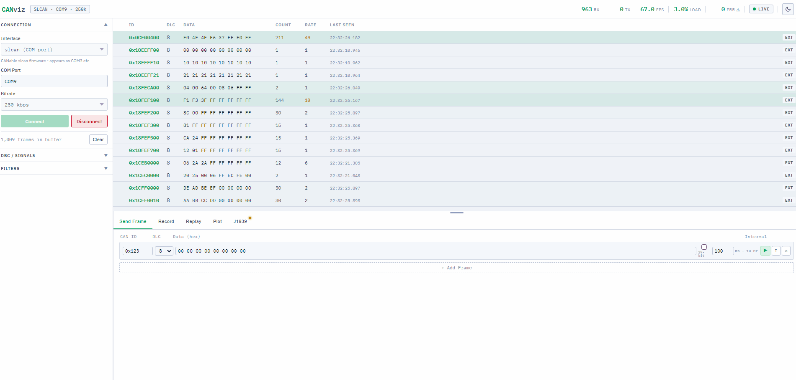

# J1939 Decoder - CANviz Guide

CANviz includes a passive J1939 decoder that works with any supported hardware at **250 kbps** - no additional setup, no extra hardware, no DBC file required for basic operation.

> **Quick start:** Connect at 250 kbps → open the **J1939** tab → click **Enable Decoder**.



---

## What is J1939?

SAE J1939 is the dominant CAN-based protocol for heavy-duty vehicles, agricultural machinery, and marine systems. If you are debugging a truck, a tractor, a combine harvester, a generator, a marine engine, or industrial equipment - there is a very good chance it speaks J1939.

J1939 builds a structured identity layer on top of standard CAN. Every message carries:

- **Who sent it** - Source Address (SA): a unique 8-bit identifier per ECU (e.g. Engine, Brakes, Transmission)
- **What kind of data it is** - Parameter Group Number (PGN): identifies the message type (e.g. Engine Speed, Vehicle Speed, Active Faults)
- **Who it is for** - Destination Address (DA): either a specific ECU or broadcast to all

J1939 uses **29-bit extended CAN IDs** (not the standard 11-bit). This is how CANviz auto-detects J1939 traffic - when it sees extended-ID frames, it offers to enable the decoder.

---

## Bitrate

| Application | Bitrate |
|---|---|
| Heavy trucks, agriculture, marine (NMEA 2000) | **250 kbps** ← most common |
| J1939/14 high-speed variant | 500 kbps |
| Passenger cars (OBD-II / UDS) | 500 kbps - *not J1939* |

Set your hardware to 250 kbps unless you know your system uses the high-speed variant.

---

## What the Decoder Shows

### Nodes tab - Live ECU network map

Every ECU that transmits a frame is tracked in the Nodes table. You see its Source Address (hex), its standard J1939 name, total frame count, and when it last transmitted. This gives you the live network topology without needing a wiring diagram.

**Source Address (SA)** is the "From:" on every J1939 frame. The J1939 standard assigns names to each address: 0x00 = Engine #1, 0x0B = Brakes - System Controller, 0x10 = Trip Recorder, 0x21 = Cab Controller - Primary, and so on up to 99 named addresses from the bundled database.

### Message table - J1939 columns

When the decoder is enabled, four columns are added to the live message table:

| Column | What it shows |
|---|---|
| **PGN** | Parameter Group Number in hex (e.g. 0xFEF1) |
| **PGN Name** | Human name (e.g. CCVS - Cruise Control / Vehicle Speed) |
| **SA** | Source address hex + ECU name below it |
| **DA** | Destination address, or "BC" for broadcast |

Row badges:
- **BAM CM** - this frame is a Transport Protocol Connection Management frame (start of a multi-packet message)
- **BAM DT** - this frame is a Transport Protocol Data Transfer frame (chunk of a multi-packet message)
- **DM1 (n)** - this frame is a DM1 Active Fault broadcast with *n* active faults

### BAM Log - Multi-packet message reassembly

CAN frames are limited to 8 bytes. J1939 sends longer messages (Vehicle Identification Number is 17+ characters, software version strings are longer still) using the **Broadcast Announce Message (BAM)** transport protocol:

1. A BAM CM frame announces: "I'm about to send X bytes of PGN Y in Z packets"
2. Data Transfer frames follow, each carrying 7 bytes
3. CANviz reassembles all packets and shows the complete payload

The BAM Log shows each completed multi-packet message with its PGN name and full hex payload. The same PGN replaces its previous entry rather than accumulating duplicates.

### DM1 Faults - Active diagnostic trouble codes

**DM1 (Diagnostic Message 1)** is how J1939 ECUs report active faults. Any ECU with a problem broadcasts DM1 frames listing its current fault codes. This is the J1939 equivalent of OBD-II trouble codes, but more structured.

Each fault record contains:

| Field | Full name | What it means |
|---|---|---|
| **SPN** | Suspect Parameter Number | Which component has the fault (e.g. SPN 100 = Engine Oil Pressure) |
| **FMI** | Failure Mode Identifier | How it is failing - see table below |
| **OC** | Occurrence Count | How many times detected since last cleared (0–127) |
| **MIL** | Malfunction Indicator Lamp | The "check engine" light - active means the driver sees it |
| **Red Stop** | Red Stop Lamp | Serious fault - stop immediately |
| **Amber Warn** | Amber Warning Lamp | Caution - service required soon |
| **Protect** | Protect Lamp | Engine protection active, may be derated |

#### FMI codes

| FMI | Meaning |
|---|---|
| 0 | Above normal operating range |
| 1 | Below normal operating range |
| 2 | Erratic, intermittent, or incorrect |
| 3 | Voltage above normal / short to high source |
| 4 | Voltage below normal / short to low source |
| 5 | Current below normal / open circuit |
| 6 | Current above normal / short to ground |
| 7 | Mechanical system not responding properly |
| 8 | Abnormal frequency, pulse width, or period |
| 9 | Abnormal update rate |
| 10 | Abnormal rate of change |
| 11 | Root cause not known |
| 12 | Bad intelligent device or component |
| 13 | Out of calibration |
| 14 | Special instructions |
| 31 | Condition exists (no specific failure mode) |

---

## PGN Coverage

CANviz ships with **54 built-in PGN definitions** covering the most commonly seen message types. The bundled `pretty_j1939` database adds SA address names (99 entries) and SPN definitions (11 entries) for DM1 fault name display.

Commonly decoded PGNs include:

| PGN | Label | Description |
|---|---|---|
| 0xF004 (61444) | EEC1 | Engine Speed / Torque |
| 0xFEF1 (65265) | CCVS | Cruise Control / Vehicle Speed |
| 0xFEF3 (65267) | ET1 | Engine Temperature 1 |
| 0xFEF5 (65269) | AMB | Ambient Conditions |
| 0xFEF7 (65271) | VEP1 | Vehicle Electrical Power |
| 0xFECA (65226) | DM1 | Active Diagnostic Trouble Codes |
| 0xFEEC (65260) | VI | Vehicle Identification (via BAM) |
| 0xEC00 (60416) | TP.CM | Transport Protocol Connection Mgmt |
| 0xEB00 (60160) | TP.DT | Transport Protocol Data Transfer |
| 0xEE00 (60928) | AC | Address Claimed |

Unknown PGNs display as `PGN 0xXXXX` - the raw hex value - so all traffic is still visible even without a name.

---

## Full Signal Decode - DBC Files

The built-in decoder identifies *what* each message is. To decode the actual **signal values** inside each message (engine RPM as a number, vehicle speed in km/h, coolant temperature in °C), you need a J1939 DBC file.

**Load a DBC file via the DBC / Signals panel** in the sidebar. CANviz uses [cantools](https://github.com/eerimoq/cantools), which natively supports J1939 DBC files. Once loaded, decoded signals appear inline in the message table and are immediately available in the Plot tab.

Where to get a J1939 DBC file:
- Your vehicle or equipment manufacturer (typically provided to service partners)
- Tools like Vector CANdb++ can export J1939 DBCs
- Some OEM service portals include them in service documentation packages

For even fuller SPN coverage, the [SAE J1939 Digital Annex](https://www.sae.org/standards/content/j1939da_201907/) is the authoritative database ($300–800). If you have it, convert it with `create_j1939db-json` (from the `pretty_j1939` package) and place the result at `%APPDATA%\pretty_j1939\J1939db.json` on Windows or `~/.config/pretty_j1939/J1939db.json` on Linux. CANviz will load it automatically on next start.

---

## CLI Usage

J1939 is fully supported in headless and SSH workflows.

### Terminal monitor with J1939 columns

```bash
canviz monitor --interface slcan --channel COM3 --bitrate 250000 --j1939
```

Adds **PGN** and **SA** columns to the live Rich table. Works over SSH with no browser. Pipe to `jq` for filtering:

```bash
# Show only Engine #1 traffic (SA 0x00)
canviz monitor --interface socketcan --channel can0 --bitrate 250000 --j1939 \
  | jq 'select(.sa == "0x00")'

# Show only DM1 frames
canviz monitor --interface socketcan --channel can0 --bitrate 250000 --j1939 \
  | jq 'select(.pgn == "0xFECA")'
```

### Inspect decoder status from a running server

```bash
# In one terminal - start the server
canviz serve --interface slcan --channel COM3 --bitrate 250000

# In another terminal - check J1939 status
canviz j1939 status
```

`canviz j1939 status` prints the full picture: decoder mode, PGN database size, live nodes table, BAM log, and DM1 active faults - all formatted as Rich tables in the terminal.

---

## Limitations

| Limitation | Detail |
|---|---|
| **PGN coverage** | 54 built-in definitions. Unknown PGNs show raw hex. Load a J1939 DBC for full signal decode. |
| **SPN coverage** | 11 SPN names bundled (freely licensed sources). Full SPN names require the SAE Digital Annex. |
| **RTS/CTS transport** | Only BAM (broadcast) reassembly is implemented. Peer-to-peer RTS/CTS is not. BAM covers most passive capture use cases. |
| **J1939-22 (CAN FD transport)** | Requires CAN FD hardware. Not supported in this release. |
| **Signal values** | The decoder identifies PGNs and decodes DM1 faults. Numeric signal values (RPM, speed, temp) require a DBC file. |
| **Active node role** | CANviz is a passive listener only. It does not implement address claiming, respond to requests, or act as a J1939 node. |

---

## Related

- [Device Guide](interfaceguide.md) - which interface to use for your hardware
- [CLI Guide](cli.md) - headless and SSH operation
